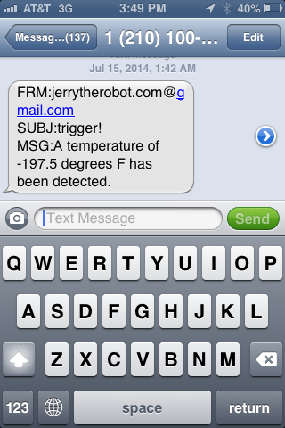

# Is your fridge getting too hot? We set up a Fido to send text message alerts when our fridge gets too warm and we fixed some bugs while we were at it!.md

Can I use Fido as an alarm when my fridge is too warm? It's a question Dogi and I have heard many times from people who run bio labs, restaurants, and here at the Pirateship hackerspace which has a particularly pesky fridge that tends to open itself sometimes. We decided to see if Fido is a good fit so we gave it a try.  We taped a Fido to the side of one of the refrigerators at the Pirateship and ran the temperature sensor into the freezer section of the fridge.  On our laptop we visited the Web App the Fido was broadcasting on our WiFi.  As we watched the temperature drop to levels previously never seen on a Fido; we usually put these things in greenhouses and cold frames where we've seen Charde plants suffering through crazy temperatures like 125 degrees Farenheit. We set the alerts on the Fido to text message us when -5 degrees Farenheit was reached, boy were we in for a surprise.

-197.5 degrees F! It looks like we had found a bug. After looking into the code it turned out the problem was possibly in the Node.js module we were using to poll the temperature sensor.  We confirmed the same behavior on a second device and [filed a bug](https://github.com/asmuelle/node-temper1/issues/5). To make sure it wasn't actually a problem with the sensors, we tried another library to poll the temper1 temperature sensor. We used [temper-python](https://github.com/padelt/temper-python) and found that it was correctly sensing below freezing temperatures. 

After some code refactoring we had [modified our Fido code](https://github.com/rjsteinert/Fido/pull/1/files) to poll the temperature sensor using the temper-python library. The really exciting part for us was that we now had a release to push to all of our other remote Fidos in greenhouses around the northeast. Before just pushing the release it was time to do QA! We set up another Fido without the update, rolled an update script on a QA Update Server, and set the Fido receive updates from the QA Update Server. This was no simple code update, this update script also had dependencies to pull in and another setup script to run, [our slickest update to date](https://github.com/rjsteinert/Fido-Updater-QA/blob/master/scripts/0.0.4.js) using the Update framework mentioned in our [proposal for an Open Ground SDK](http://publiclab.org/notes/rjstatic/07-09-2014/thinking-about-a-small-linux-web-app-server-initiative-who-wants-to-join). After testing the update on our QA Fido, it failed! We had [missed a semicolon in the update script](https://github.com/rjsteinert/Fido-Updater-QA/commit/c47dd9889c53b44236845a6bab977111bdd2e6b1#diff-8b797751080e4ce6c3d013c94268770e). Doh! This is why we do QA!

After resetting the QA Fido we reran the update with success! To be extra careful we set up a second QA Fido and also saw the same success.  Then we sent that update to the actual Update Server that all of the remote Fidos in the world listen to.  Just to be extra extra extra careful we tested the deployed update on another Fido we have here.  It sure takes a lot of Fido to make a solid update! Good dogies. 

