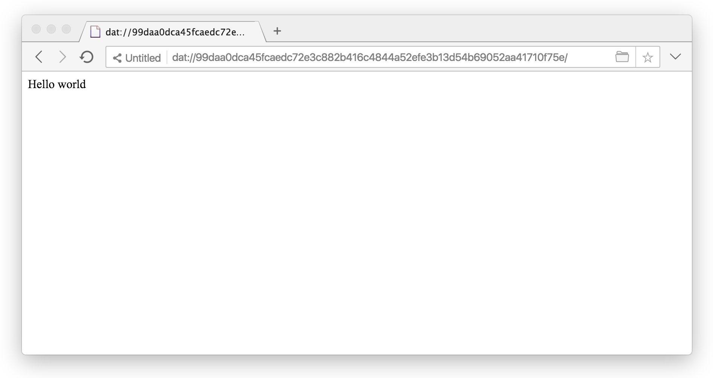
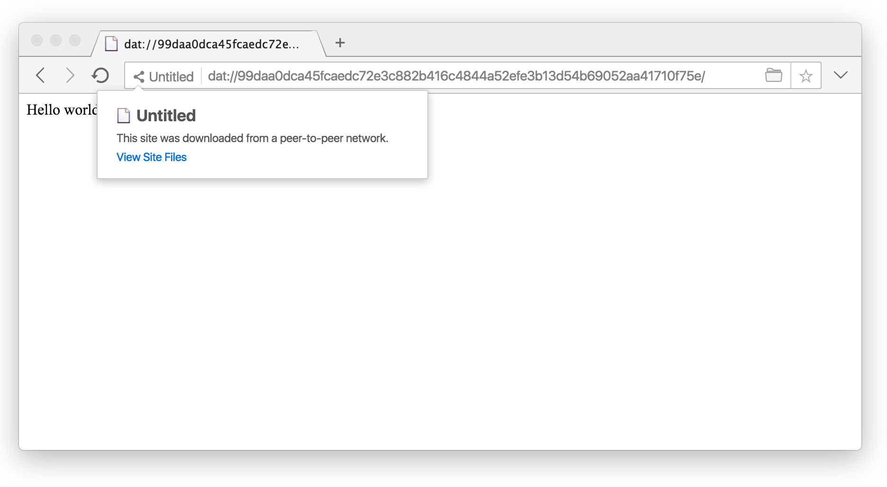
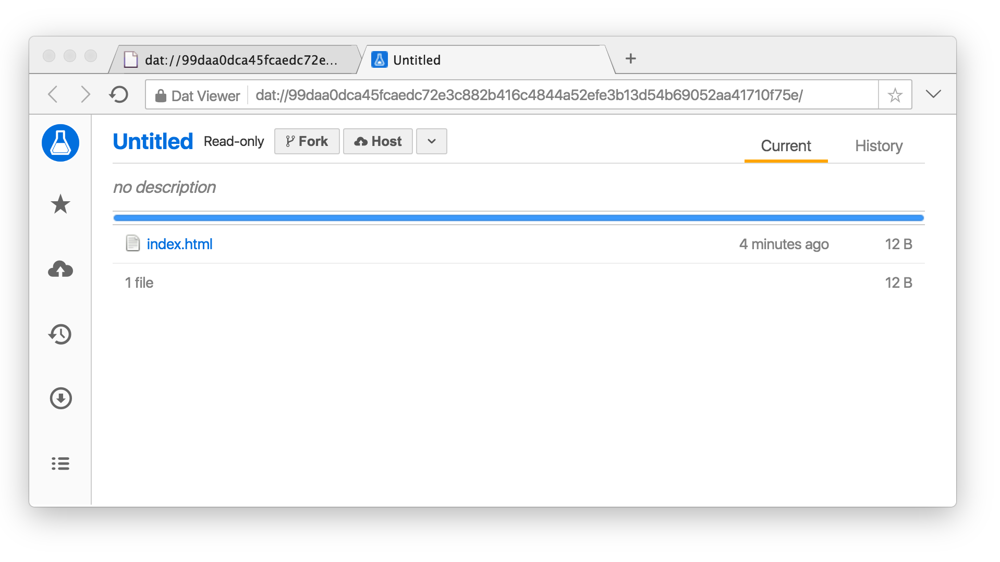
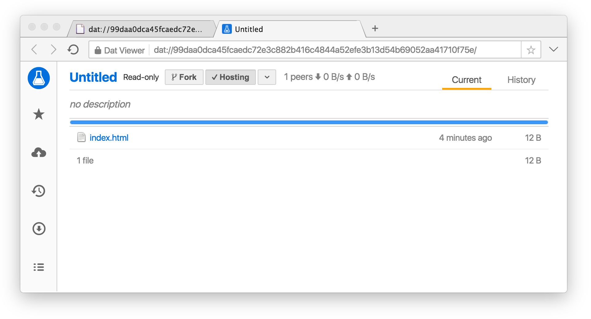
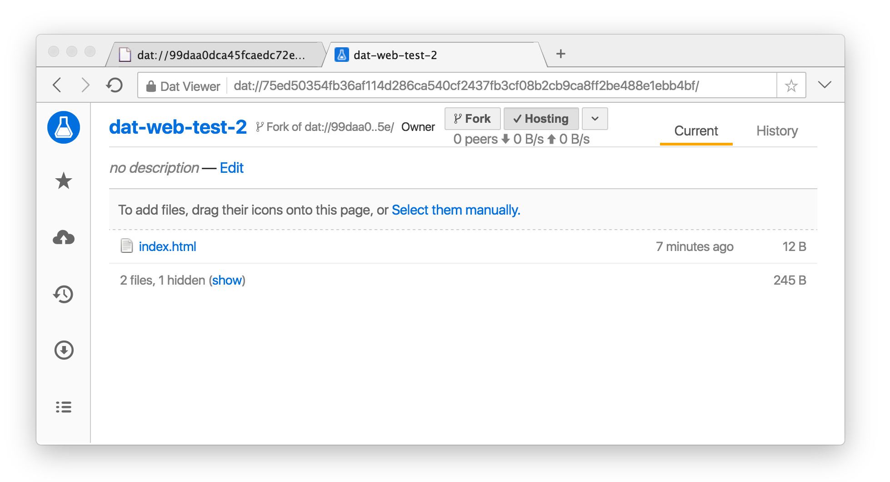

# Publish to the Distributed Web in 3 commands using Dat

Install [nodejs](https://nodejs.org/en/), [dat](http://docs.datproject.org/), and [Beaker Browser](https://beakerbrowser.com/) on your computer and in 3 commands you'll be publishing on to the Distributed web hosting a hello world from your machine.

Run these 3 commands...

```
▶ mkdir dat-web-test
▶ echo "Hello world" >> dat-web-test/index.html
▶ dat dat-web-test/
Sharing /Users/rsteinert/dat-web-test

Share Link: 99daa0dca45fcaedc72e3c882b416c4844a52efe3b13d54b69052aa41710f75e
The Share Link is secret and only those you share it with will be able to get the files

[=============================>] Sharing 1 file (12 B)

Waiting for connections.
```

Copy that share link and paste it into the Beaker Browser. Share that URL with anyone running Beaker Browser and they'll see this website hosted from your computer!



Now let's try out being a peer host to improve availability when my other computer shuts down. Click on the site menu and click "View Site Files"...



Now click on the "Host" button...



Now we're hosting that site from the Beaker Browser and our friends can too!



Anyone can fork this site to their own site and make modifications using the fork button.



And there is more! See https://beakerbrowser.com/.

[gimmick:Disqus](rjsteinert-github-io)
